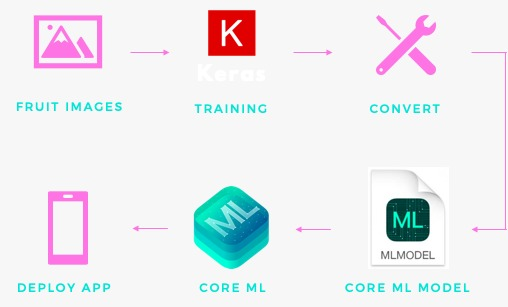

# fruit_hero  
Fruit classifier deployed as an iOS App

Fresh fruits and vegetables account for 50% of the overall european union food waste. 
This fact served us as the main motivational driver to build our project upon. 
With fruit_hero we wanted to utilize the skills and technologies we learned during our masters to contribute a small solution to the big problem of todays society.

Our result is a Deep Learning algorithm which specifies the type and condition (fresh or rotten) of fruits. 
Furthermore, we deployed the model into an IOS app ensuring a convenient usage for end customers.

## Structure of the Repository

**fruit_hero.xcodeproj** - Default project folder for XCode  
**fruit_hero** - Project files written in SWIFT from the respective XCode project  
**fruit_heroTests** - Default project folder for functionality test purposes  
**fruit_heroUITests** - Default project folder for user interface test purposes  
**jupyter** - Jupyter notebook containing all steps of creatig the Deep Learning algorithm for debug-execution  
**model** - Models in a .model format which is used to convert into iOS readable .mlmodel  
**pickle** - Pickled Lable Binarizer as a storage for our lables  
**plot** - Informative graph about Training Loss and Accuracy  
**python** - Python scripts for direct execution via commandline  

## Workflow

The logical approach of this project follows the displayed flow:

We begin with training a Deep Learning model on a set of labeled pictures of fresh and rotten apples, oranges and bananas.
The used model is a VGGNet  with 16 convolutional layers, 3x3 convolutions and 138M parameters. 
For reducing the volume size we use max pooling. 
After the model is trained and testet we convert it into a core ML model which is an optimized format for running it on mobile iOS devices.
The converted model can be imported into XCode and from ther conveniently instantiated within the swift code for the iOS App.

## Python scripts

**train_hero.py**: This Python script contains the code for training a model on a given dataset. Parameters to be specified in the argument parser are the dataset, model, label binarizer and the name of the training Loss and Accuracy plot.  
**test_hero.py**: Python script to evaluate the trained model on a test set of images or a single image. Parameters to be specified in the argument parser are the model, label binarizer, location of test image or path to test dataset.  
**convert_hero.py**: Python script for converting the trained model into a core ML model using coremltools. Parameters to be specified in the argument parser are the model and the label binarizer.  
**transfer_hero.py**: Python script based on the train_hero.py script with a transfer learning approach. ResNet50 is used as a base model.  

All scripts are optimized to be run in the command line

## Sources
The following contains the sources we utilized within this project

### Tutorials
https://www.pyimagesearch.com/2018/04/09/how-to-quickly-build-a-deep-learning-image-dataset/  
https://www.pyimagesearch.com/2018/04/16/keras-and-convolutional-neural-networks-cnns/  
https://www.pyimagesearch.com/2018/04/23/running-keras-models-on-ios-with-coreml/  

### Data
https://www.kaggle.com/sriramr/fruits-fresh-and-rotten-for-classification  
https://www.kaggle.com/moltean/fruits  

### Information
https://ec.europa.eu/jrc/en/news/eu-households-waste-over-17-billion-kg-fresh-fruit-and-vegetables-year  
https://www.theguardian.com/environment/2016/jul/13/us-food-waste-ugly-fruit-vegetables-perfect  
https://towardsdatascience.com/a-comprehensive-guide-to-convolutional-neural-networks-the-eli5-way-3bd2b1164a53  
https://medium.com/@sidereal/cnns-architectures-lenet-alexnet-vgg-googlenet-resnet-and-more-666091488df5  
https://machinelearningmastery.com/transfer-learning-for-deep-learning/  
https://keras.io/  

&copy; Fabian Asal, Sidar Gumus, Fabian Längle
